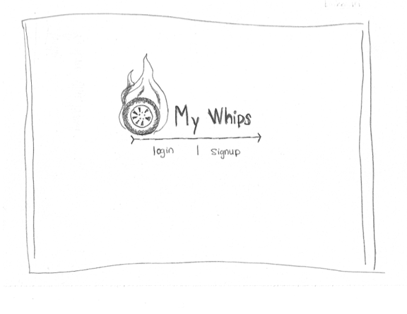
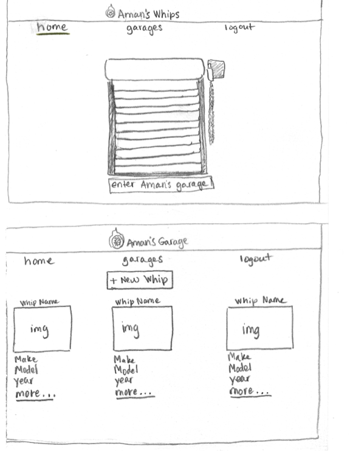

### Group Members

Aman Alem
Jonathan Rosario
Plentis Dupree, III
Corey Kim

### My Whips

My Whips is a way to showcase your personal car collection. Each of our users can create their own garage and fill it with all of their automotive treasures. They can list the specs of their cars, add pictures and detailed descriptions, and browse through the garages that other users have created.

### List of models and their properties

User = {
    name: String,
    googleId: String,
    garage: [{ref: 'Garage'}],
}

Garage = {
    cars: [{
        make: String,
        model: String,
        year: Number,
        carName: String,
        engine: String,
        transmission: String,
        HP: Number,
        topSpeed: Number,
        img: String,
        zeroToSixty: String,
        description: String,
    }]
}

### Scrum manager

Aman Alem

### User stories

*As a user, I'd like the ability to create my own personal garage of cars.
*As a user, I'd like the ability to search for cars by year, make, and model using an api.
*As a user, I'd like the ability to add cars to my garage.
*As a user, I'd like the ability to see a car's details.
*As a user, I'd like the ability to update a car in my garage.
*As a user, I'd like the ability to delete cars from my garage.
*As a user, I'd like the ability to use Google OAuth to login.
*As a user, I'd like the ability to view other user's Garages.

### Wireframes

